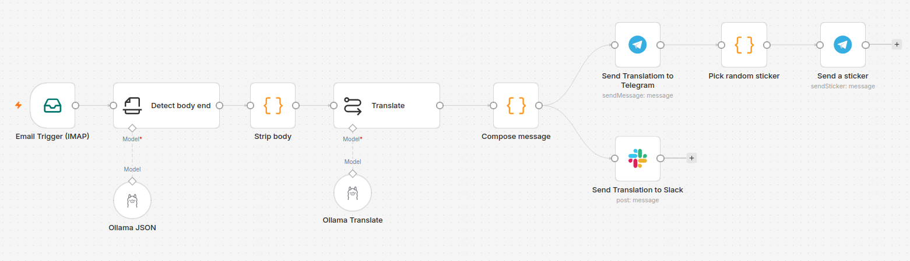

# n8n sample workflow with local agents

This is a sample n8n workflow with AI nodes linked to local AI models served through Ollama. It's implemented on a self-hosted instance of n8n.

## Self-hosted n8n instance

n8n can be self-hosted on a local machine, a dedicated server or private cloud. Docker is the officially recommended method for production use. The npm-based installation is deprecated and will be removed in n8n v3.0, so it is only suitable for quick local testing.

### Option A: Docker (Recommended)

The fastest way to get started is the official one-line setup script, which creates the necessary files and starts the service automatically:

    curl -fsSL https://get.n8n.io | sh

For a reproducible setup, use Docker Compose. Create a `docker-compose.yml` file with the following minimal configuration and later start service with `docker compose up -d`:

    version: '3.8'

    services:
      n8n:
        image: docker.n8n.io/n8nio/n8n
        container_name: n8n
        restart: unless-stopped
        ports:
          - "5678:5678"
        volumes:
          - ./n8n_data:/home/node/.n8n
        environment:
          - GENERIC_TIMEZONE=Europe/Madrid
          - TZ=Europe/Madrid

_Notes: in order to make it possible to execute local models you must enable execute commands permissions. As for a test project it's enough to set environment variable_ `export NODES_EXCLUDE='[]'` _in_ `~/.bashrc`

### Option B: npm (Testing Only)

For a quick test without Docker, you can run n8n directly with `npx`:

    npx n8n

Or alternatively you can install it globally:

    npm install n8n -g

Note that this method is deprecated and will be removed in n8n v3.0.

Start instance with

    n8n start

### Minimal Configuration

- **Timezone**: Set both GENERIC_TIMEZONE and TZ to your local timezone. This is critical for scheduled workflows (e.g., stock checks) to run at the correct time. If omitted, n8n defaults to New York time.
- **Security**: Never expose port 5678 directly to the internet. Use a reverse proxy (Caddy, Nginx) for HTTPS and strong authentication.
- **First access**: When you open http://localhost:5678 for the first time, n8n will ask you to create an owner account. Do not skip this step.

## Local Ollama service and AI models

To install local instance of Ollama and models of your choice run these commands:

    curl -fsSL https://ollama.com/install.sh | sh
    # check installation with ollama -v

    # These models are good for required tasks in this workflow
    ollama pull qwen2.5:14b    # For text analisys and information gathering
    ollama pull mistral:7b     # For translation

## Credentials for local LLM service

- Create new credential
- Choose 'Ollama' service
- Set local URL for service, probably `http://localhost:11434`
- No API key required
- After that, you can create nodes with the different "Ollama" options and set any of the local models you have installed for it. This allow to set different models in different models sharing same credentials.

## Get Telegram stickers

Script `dump-telegram-stickers.py` returns a list of stickers IDs from Telegram collections so you can customize n8n node `Pick random sticker` with your own collections. To execute script and get IDs list run next command with any number of collections. Short name of collection is expected:

    python3 dump-telegram-stickers.py <<YOUR TOKEN>> Frankestein HarryGorilla

To get short name of collection and other info there are different options, run:

    curl -s "https://api.telegram.org/bot<<YOUR TOKEN>>/getStickerSet?name=Frankestein" | python3 -m json.tool

Or run next command just after sending a sticket to bot:

    curl -s "https://api.telegram.org/bot<<YOUR TOKEN>>/getUpdates" | python3 -m json.tool

